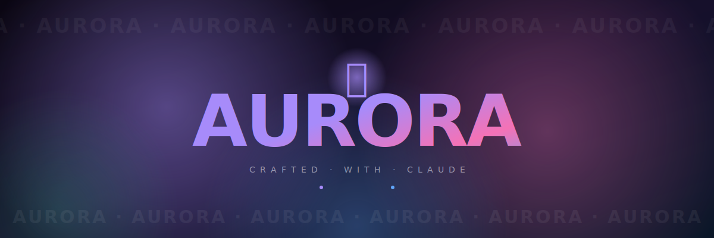

<div align="center">



<br>

<p align="center">
  <strong>A modern web design experiment — built collaboratively with Claude.</strong>
</p>

<p align="center">
  <em>Glassmorphism · Magnetic interactions · Cinematic finale</em>
</p>

<br>

<p align="center">
  
  
  
  
  
  
</p>

</div>

---

## ⚠️ Heads up — this is just a demo

> Nothing on this site is real. There is no product, no pricing, no signup, no service for sale. The "$0 / $19 / $49" tiers, the testimonials, the marquee — it's all placeholder content.
>
> This repo is a **personal playground** for modern web design and animation, built end-to-end with [Claude](https://www.anthropic.com/claude) as a coding partner. Treat it as a portfolio piece, a learning resource, or a starting point for your own project.

---

## ✨ What's inside

A single-page site with a heavy emphasis on motion, depth, and the small details that usually get cut.

| | |
| --- | --- |
| 🌌 **Animated gradient background** | Four floating blobs with parallax that respond to your cursor |
| 🪟 **Glassmorphism everywhere** | Backdrop-filter blur, soft borders, layered translucency |
| 🧲 **Magnetic buttons** | CTAs and the logo physically pull toward your cursor |
| 🎯 **Custom cursor + spotlight** | Mix-blend-mode dot, follower ring, and a soft light that trails behind |
| 💫 **Cursor trail** | Tiny colored sparks fall behind the cursor as you move |
| 🌗 **Light & dark themes** | Full pastel light theme with smooth transitions, persisted in `localStorage` |
| 📊 **Bento feature grid** | Asymmetric cards with speed-rings animation and a syntax-highlighted code block |
| 💰 **Pricing cards** | Three tiers, glassmorphic, with a featured plan that's lifted and glowing |
| 💬 **Auto-scrolling testimonials** | Infinite marquee that pauses on hover |
| ❓ **Native FAQ accordion** | Built on `<details>` with a single-open behavior |
| 📜 **Keyword marquee** | Bidirectional flowing strip between sections |
| 📈 **Animated counters** | Stats roll up with cubic easing on first reveal |
| 🎬 **Cinematic finale** | Five "AURORA" text streams flowing in opposite directions behind a giant rotating star with iridescent glow, orbital rings, and animated sparks |
| 🎮 **Konami easter egg** | ↑ ↑ ↓ ↓ ← → ← → B A — try it |
| 📐 **Responsive everywhere** | Looks good from 320px up to 4K |
| ♿ **Reduced-motion aware** | Animations collapse for users who prefer that |

<br>

## 🛠️ Tech stack

```
HTML5         ─  Semantic markup
CSS3          ─  Custom properties, backdrop-filter, color-mix, container queries
Vanilla JS    ─  IntersectionObserver, requestAnimationFrame, no dependencies
Google Fonts  ─  Inter, Space Grotesk, JetBrains Mono
```

**Zero frameworks. Zero build tools. Zero npm.** Just three files served as-is.

<br>

## 🚀 Run it locally

```bash
git clone <your-repo-url>
cd <repo>
```

Either open `index.html` directly in your browser, **or** spin up a tiny local server (recommended for the cleanest font and asset loading):

```bash
# Python 3
python3 -m http.server 8000

# Or with Node
npx serve .

# Then visit
http://localhost:8000
```

That's it. No `package.json`, no install step, no config.

<br>

## 📁 Project structure

```
.
├── index.html        # Single-page markup, ~600 lines
├── styles.css        # All styling, animations, themes — ~1900 lines
├── script.js         # Interactivity (cursor, magnets, finale, etc.) — ~350 lines
├── assets/
│   └── banner.svg    # The banner you saw at the top
└── README.md         # This file
```

<br>

## 🎨 Design notes

<details>
<summary><strong>Color palette</strong></summary>

```
Purple   #a78bfa    Pink     #f472b6
Blue     #60a5fa    Teal     #34d399
Yellow   #fbbf24    Coral    #f87171
```

The aurora gradient that appears throughout is `linear-gradient(135deg, #a78bfa 0%, #f472b6 50%, #60a5fa 100%)`.

</details>

<details>
<summary><strong>Typography</strong></summary>

- **Space Grotesk** — display headings, the rotating logo, big numbers
- **Inter** — body copy, UI, everything else
- **JetBrains Mono** — code snippets, the loader percentage, the finale credit

</details>

<details>
<summary><strong>Animation principles</strong></summary>

- Default easing: `cubic-bezier(0.22, 1, 0.36, 1)` — fast start, gentle settle
- Spring easing for celebratory reveals: `cubic-bezier(0.34, 1.56, 0.64, 1)`
- All scroll-triggered animations use `IntersectionObserver`, never scroll listeners with layout reads
- 60fps target — transforms only, no width/height/top/left animations on hot paths

</details>

<details>
<summary><strong>The finale</strong></summary>

Scroll all the way past the footer. The last viewport is dedicated to a single composition:

- 5 layered streams of "AURORA · AURORA · AURORA …" flowing left and right at different speeds, sizes, and treatments (filled, outlined, gradient)
- A huge ✦ star at center with shifting iridescent gradient, slow rotation, and a pulsing drop-shadow glow
- 3 concentric orbital rings with colored markers
- 8 sparks orbiting at different timings and colors
- Soft radial vignette
- Footer fades and lifts as the finale comes into view, creating a true cross-fade transition

</details>

<br>

## 🤖 About the build process

This entire thing was built in a conversational loop with [Claude](https://www.anthropic.com/claude):

1. "Build a beautiful site with a floating background"
2. "Add more — go further"
3. "Now go truly wild"
4. "Actually I liked the previous one — bring it back, but better, and add a star finale"
5. "Remove the floating dots"
6. "Make a nice README"

Each turn was a single natural-language prompt; Claude handled all the code: HTML structure, CSS animations, vanilla JS interactivity, and this README. The site is the artifact of that conversation.

<br>

## 🙏 Acknowledgements

- Inspired by the design language of [Linear](https://linear.app), [Vercel](https://vercel.com), and the broader Awwwards aesthetic
- Star glyph: ✦ (Unicode `U+2726`)
- Built with Claude · 2026

<br>

## 📄 License

MIT — do whatever you want with it. If you build something cool from this, drop a ⭐.

<br>

<div align="center">
  <sub>✦ Made with Claude ✦</sub>
</div>
